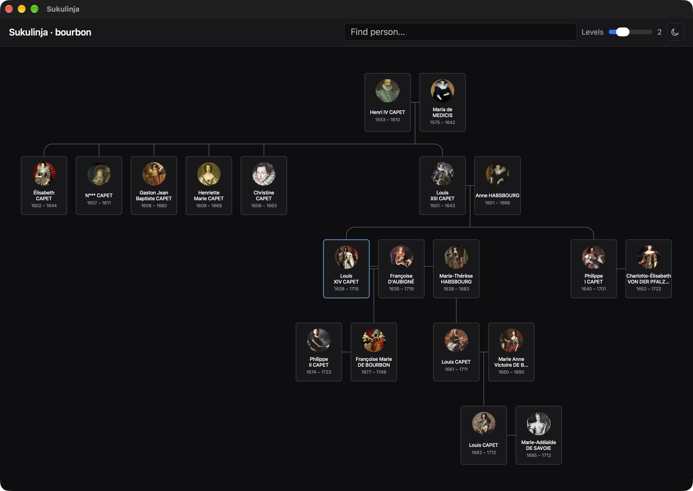

# Sukulinja

DIY genealogy editor, early prototype — currently an hourglass family tree chart for GEDCOM files, with portraits.

Portraits come from the image files beside the GEDCOM, or are downloaded from a MyHeritage export.

Includes a House of Bourbon demo dataset.



## Setup

Requires [Bun](https://bun.sh/); the desktop app is macOS only.

```bash
bun install
bun dev       # serve the app in a browser
```

To build and install to `/Applications`:

```bash
brew install openssl   # one-time
bun cert --create      # one-time: create a self-signed code-signing cert
bun install:app        # build, sign, and copy to /Applications
```

## Docs

- [CONTEXT](CONTEXT.md) — terms and relationships
- [ADR](docs/adr/) — architectural decisions
